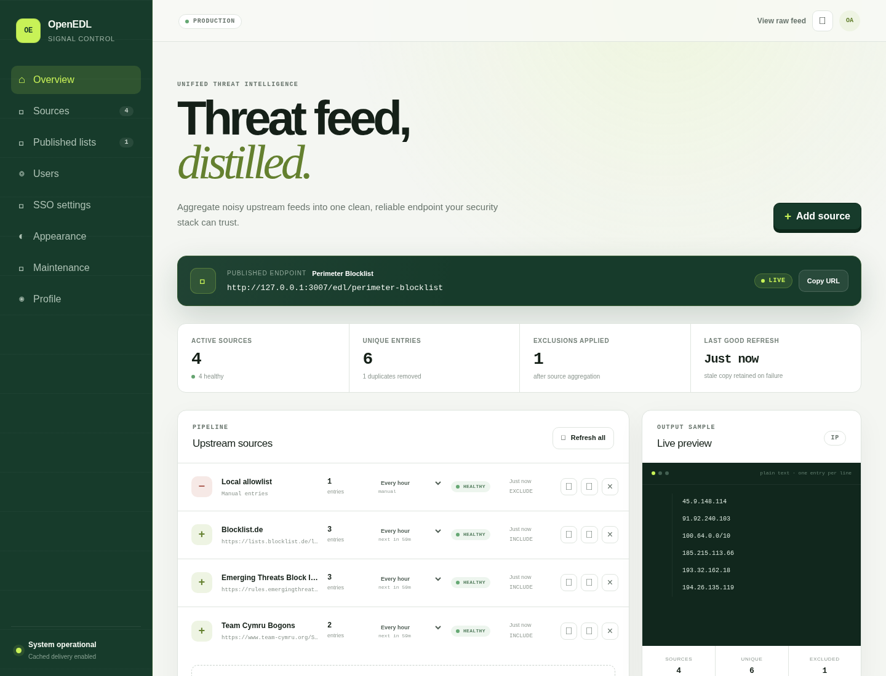
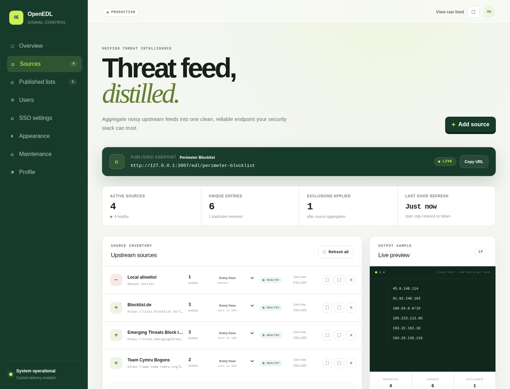
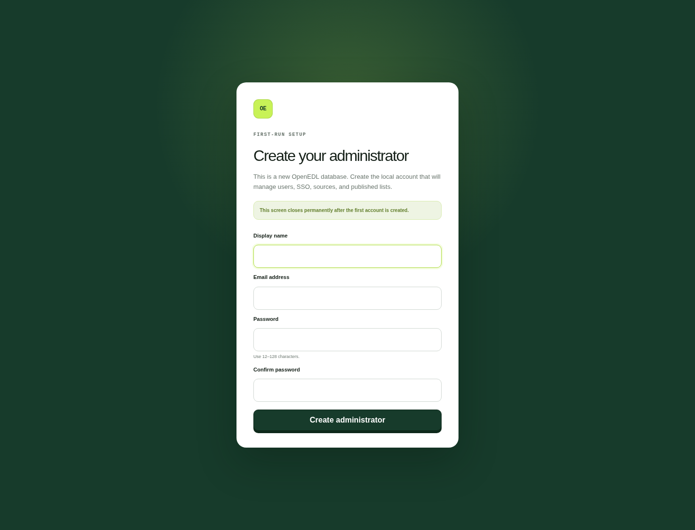

# OpenEDL

OpenEDL is a self-hosted External Dynamic List (EDL) manager for security teams. It pulls threat feeds and manual entries, normalizes IP/domain/URL indicators, applies allowlist exclusions, deduplicates results, and publishes clean plain-text endpoints for firewalls, proxies, and security tools.

## About

OpenEDL turns noisy upstream threat intelligence into a small set of reliable, vendor-neutral list URLs that your perimeter stack can consume. It includes a browser-based admin portal, local and OIDC authentication, encrypted API feed secrets, scheduled refreshes, and last-known-good caching so feed outages do not break policy delivery.

## Screenshots







## Highlights

- Manage IP, domain, and URL lists from one interface.
- Ingest remote text feeds, CSV/manual uploads, JSON API responses, generic authenticated APIs, and the Recorded Future risk-list preset.
- Combine include and exclude sources into one deduplicated published endpoint.
- Keep serving the last-known-good list when an upstream source fails.
- Configure per-source refresh schedules from five minutes to weekly.
- Use local email/password accounts or OIDC SSO with Google, Microsoft Entra ID, or a custom provider.
- Store management sessions in HttpOnly cookies and encrypt GUI-managed provider/feed secrets with AES-GCM.
- Deploy with Docker and SQLite, or run serverlessly on Cloudflare Workers with D1.

## Quick start with Docker

The recommended image is published to GitHub Container Registry:

```text
ghcr.io/emmolab/openedl:latest
```

Run it with Compose:

```bash
cp .env.example .env
docker compose up -d
```

Open `http://localhost:3000` and create the first local administrator. The setup screen only appears while the database has no users.

The Compose deployment stores SQLite data in the `openedl-data` volume. Back up that volume regularly and run only one OpenEDL container against a given database volume.

## Local development

OpenEDL requires Node.js 24.15 or newer.

```bash
cp .env.example .env
npm ci
npm run dev
```

The dashboard runs at `http://localhost:3000`. A seeded list is published at:

```text
http://localhost:3000/edl/perimeter-blocklist
```

## Configuration notes

- Set `CONFIG_ENCRYPTION_KEY` before adding SSO providers or authenticated API sources in the UI:

  ```bash
  openssl rand -base64 32
  ```

- Set a stable `CRON_SECRET` only when an external scheduler needs to call `POST /api/cron/refresh`; otherwise the Docker container generates an internal scheduler token.
- If the local administrator password is lost, reset it from the container:

  ```bash
  docker compose exec openedl node openedl-cli.mjs reset-admin-password admin@example.com
  ```

## Documentation

- [SSO configuration](docs/SSO.md)
- [Cloudflare Workers deployment](docs/CLOUDFLARE.md)
- [Environment template](.env.example)
- [Cloudflare environment template](.env.cloudflare.example)

## Deployment options

| Deployment | Runtime and storage | Best for |
| --- | --- | --- |
| Docker | Node.js container with persistent SQLite | Self-hosting, simple backups, and portable deployments |
| Cloudflare Workers | Workers, D1, and Cron Triggers | Serverless edge hosting without managing a container host |

Docker SQLite and Cloudflare D1 are separate storage backends and do not automatically synchronize.

## Current scope

OpenEDL currently focuses on list creation, feed ingestion, publishing, authentication, scheduling, and storage maintenance. Richer audit history, pagination, and STIX/TAXII transforms are planned for later milestones.
